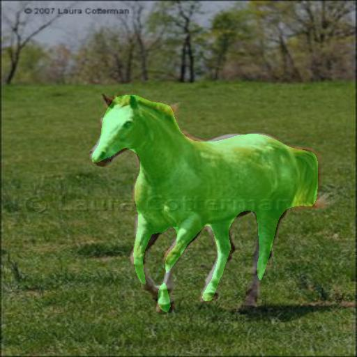
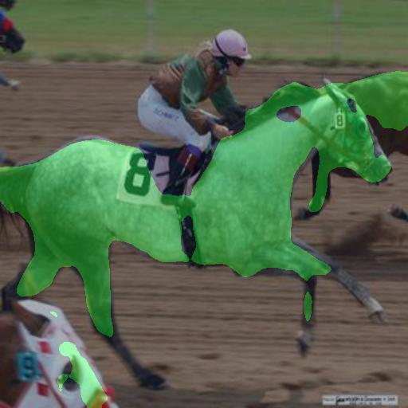
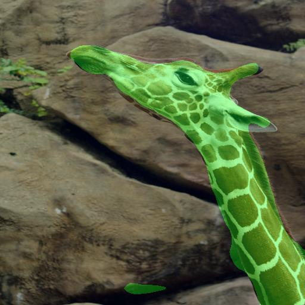
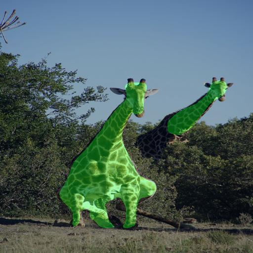
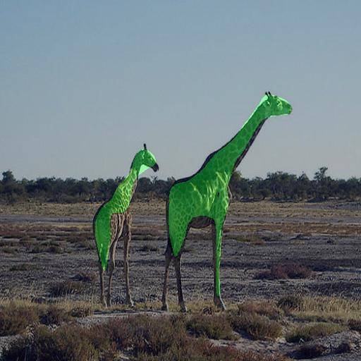
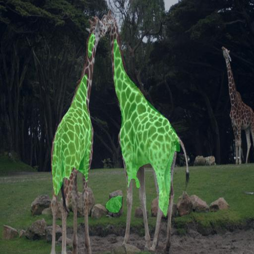
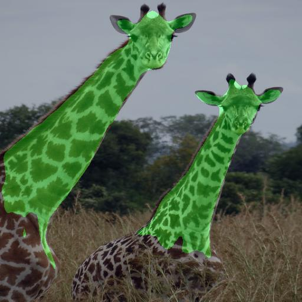
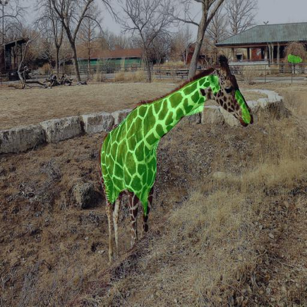

# Semantic Aware Attention Based Deep Object Co-segmentation

  - Object Cosegmentation with Deep learning and Attention Module
  - Capable of segment unseen obejct
  - Cosegment multiple inputs with linear time.
 
 ## Two inputs


 ## Mutiple inputs



# Model


Model:
  - Encoder : VGG16 (last layer before fc layer)
  - Attention Module
  - Decoder : Deconvolution layers


# Install

Here is the list of libraries you need to install to execute the code:
- python = 3.6
- [pytorch](http://pytorch.org/) = 0.4
- Pillow
- Numpy
- Glob

## Train model
For example:
```
python train.py --train_data "Datasets/PascalVoc/image/" --train_label "Datasets/PascalVoc/colabel/train/" --train_txt "Datasets/PascalVoc/colabel/train.txt" --val_data "Datasets/PascalVoc/image/" --val_label "Datasets/PascalVoc/colabel/val/" --val_txt "Datasets/PascalVoc/colabel/val.txt" --model_path "model_path/"
```

## Co-segment two images
For example:
```
python single_demo.py --image1 "demo/1.jpg" --image2 "demo/2.jpg" --output1 "demo/co_1.jpg"  --output2 "demo/co_2.jpg" --model "model_path/epoch0iter5000.pkl"
```

## Co-segment multiple images
For example:
```
python group_demo.py --image_path "group_demo/images/" --output_path "group_demo/outputs/" --model "model_path/epoch0iter5000.pkl"
```
Inputs and outputs all seperate into two different directories.

